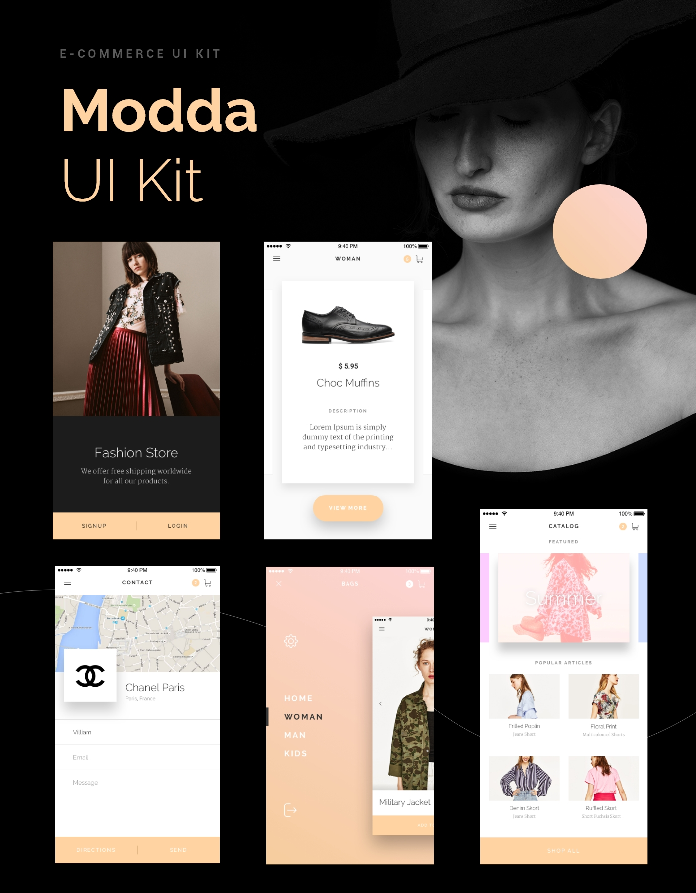

# CSS "Modda"

> CSS exercise given at HEPL

* * *

**CSS "Photoshop Etiquette"** is an educational project, which will be used for `HTML`/`CSS` courses.

**Note:** the school where the course is given, the [HEPL](http://www.provincedeliege.be/hauteecole) from Liège, Belgium, is a french-speaking school. From this point, the instruction will be in french. Sorry.

* * *

## Modda E-Commerce

Vous trouverez dans ce dossier une page HTML nommée **index.html**. Cette page est tirée d'un template disponible[ici](http://csform.com/product/modda-e-commerce-ui-kit-free-sample-for-adobe-xd/).

Le rendu final désiré est le suivant : 

### Consignes

* Créer et lier le fichier **styles.css** à la page **index.html**.
* Utiliser un reset, celui d'[Eric Meyer](https://meyerweb.com/eric/tools/css/reset/) par exemple.
* En vous fiant aux rendus attendus du fichier Adobe XD, compléter la feuille de styles.
* Toutes les images à utiliser se trouvent dans le dossier **img**.
* Bon travail et bon amusement&nbsp;!

* * *

### Outils

- [Comment masquer un élément visuellement ?](https://css-tricks.com/places-its-tempting-to-use-display-none-but-dont/)
- [Comment importer une typo avec @font-face ?](https://developer.mozilla.org/fr/docs/Web/CSS/@font-face)
- Comment utiliser adobe XD ? (vidéo à venir) 
- En attendant, si vous avez besoin d'aide pour utiliser Adobe XD, vous pouvez chercher des solutions dans la [documentation officielle](https://helpx.adobe.com/be_fr/xd/tutorials.html) ou me poser des questions sur Slack.

Adaptation et intégration par & [François Parmentier](https://github.com/fprms).
